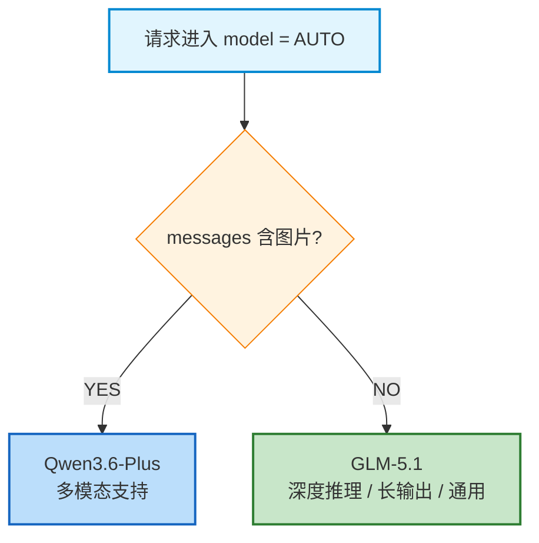

# AUTO 智能模型路由 — 设计文档

> 版本：v1.1 | 日期：2026-04-26 | 作者：awen

---

## 1. 背景与目标

用户在调用 AI API 时，往往不清楚哪个模型最适合当前请求。本功能提供虚拟模型 `AUTO`，系统自动根据请求内容（是否包含图片）将请求路由到最合适的真实模型。

### 候选模型

| 模型 | 多模态 | 最大输出 | 推理能力 | 适用场景 |
|------|--------|----------|----------|----------|
| Qwen3.6-Plus | 支持（图片） | 16K | 强 | 多模态、代码、Agent |
| GLM-5.1 | 纯文本 | 128K | 强（深度推理） | 长输出、深度推理、通用对话 |

### 设计原则

- **不考虑价格**，仅按请求特征路由
- **简单明确**：图片走多模态模型，其他走推理模型
- **零侵入**：不改变现有模型调用链路，仅在分发环节拦截替换

---

## 2. 行业参考

| 厂商/产品 | 策略 | 关键启示 |
|-----------|------|----------|
| OpenAI | AI 分类器自动选模型（已对免费用户回滚） | 不要替用户做慢决策 |
| GitHub Copilot | 可用性优先，Fast/Edit/Agent 三档 | 简单分档比复杂路由更可靠 |
| Cursor | 复杂度 + 可靠性评分路由 | 明确升级信号比猜测意图更准 |
| OpenRouter/NotDiamond | 第三方路由器，性能+成本+延迟多维度 | 三级路由（硬约束 → 升级信号 → 默认）是业界共识 |

---

## 3. 路由决策树

```
请求进入 (model = "AUTO")
│
├── messages 包含图片（image_url）？
│   └── YES → Qwen3.6-Plus（多模态支持）
│
└── NO → GLM-5.1（默认：深度推理、长输出、通用对话）
```

### 路由流程图



> 图例：橙色菱形 = 路由条件判断，蓝色方框 = 多模态路由结果，绿色方框 = 默认路由结果

### 整体处理流程

```mermaid
flowchart LR
    subgraph 客户端
        REQ[发送请求<br/>model = AUTO]
    end

    subgraph 网关处理
        MW[middleware/distributor<br/>拦截 AUTO 请求] --> PARSE[解析请求体<br/>提取路由特征]
        PARSE --> ROUTER[service/auto_router<br/>路由决策引擎]
        ROUTE_RESULT[routed_model] --> REPLACE[替换 model 名称]
    end

    subgraph 正常分发
        REPLACE --> DIST[渠道选择<br/>负载均衡]
        DIST --> RELAY[relay 转发<br/>调用上游 API]
    end

    subgraph 后处理
        RELAY --> LOG[记录日志<br/>model_name=AUTO<br/>routed_model_name=实际模型]
        LOG --> BILL[计费结算<br/>按真实模型倍率]
        BILL --> RESP[返回响应]
    end

    REQ --> MW
    ROUTER --> ROUTE_RESULT

    style REQ fill:#e1f5fe,stroke:#0288d1
    style MW fill:#fff3e0,stroke:#f57c00,stroke-width:2px
    style ROUTER fill:#fff3e0,stroke:#f57c00,stroke-width:2px
    style LOG fill:#e8f5e9,stroke:#388e3c,stroke-width:2px
    style BILL fill:#e8f5e9,stroke:#388e3c,stroke-width:2px
```



### 路由规则说明

| 条件 | 检测方式 | 路由目标 | 原因 |
|------|----------|----------|------|
| 包含图片 | 解析 messages 中 `content` 数组，检测 `type: "image_url"` | Qwen3.6-Plus | GLM 系列不支持多模态 |
| 其他所有情况 | - | GLM-5.1 | 深度推理能力强，支持 128K 输出 |

---

## 4. 实现方案

### 4.1 总体方案：虚拟模型（Plan A）

将 `AUTO` 注册为虚拟模型，在模型元数据表 `model_meta` 中创建一条记录，标识为自动路由模型。用户在模型广场可以看到并选择 AUTO 模型。

```
用户请求 model="AUTO"
    ↓
middleware/distributor.go 拦截
    ↓
检测到 AUTO → 调用路由决策引擎
    ↓
替换 model 为真实模型名称（如 "qwen3.6-plus"）
    ↓
走正常分发流程（选渠道、转发请求）
```

### 4.2 模块设计

#### 4.2.1 AUTO 模型注册

在 `model_meta` 表中新增 AUTO 记录：

```sql
INSERT INTO model_meta (name, label, description, auto_route)
VALUES ('AUTO', 'AUTO', '智能路由 - 自动选择最合适的模型', 1);
```

- `auto_route` 字段标识该模型为自动路由模型
- 模型广场展示时，AUTO 作为普通模型显示，附加"智能路由"标签

#### 4.2.2 路由决策引擎

采用规则包架构，每个路由规则独立一个文件，实现统一的 `Rule` 接口。

**包结构：**

```
service/
├── auto_router.go                    # 入口：IsAutoModel + RouteAutoModel + 规则注册
└── auto_router/
    └── rule/                          # 规则包
        ├── rule.go                    # Rule 接口 + MatchFirst 匹配器 + Request/Message 类型
        ├── constant.go                # 模型名常量
        └── rule_multimodal.go         # 图片检测规则
```

**Rule 接口定义（`auto_router/rule/rule.go`）：**

```go
type Rule interface {
    Name() string
    Match(req *Request) bool
    TargetModel() string
}

func MatchFirst(rules []Rule, req *Request) (ruleName string, targetModel string, matched bool)
```

**模型名常量（`auto_router/rule/constant.go`）：**

```go
const (
    DefaultRoutedModel    = "GLM-5.1"
    MultimodalRoutedModel = "qwen3.6-plus"
)
```

**规则注册（`service/auto_router.go`）：**

```go
var autoRouteRules = []rule.Rule{
    rule.Multimodal(),
}
```

**扩展新规则只需：** 在 `auto_router/rule/` 下新建文件实现 `Rule` 接口，然后在 `autoRouteRules` 切片中注册。

#### 4.2.3 图片检测规则（`auto_router/rule/rule_multimodal.go`）

解析 OpenAI 格式的 messages 数组，检测多模态内容：

```go
type multimodalRule struct{}

func (multimodalRule) Name() string { return "multimodal" }

func (multimodalRule) Match(req *Request) bool {
    for _, msg := range req.Messages {
        parts, ok := msg.Content.([]interface{})
        if !ok {
            continue
        }
        for _, item := range parts {
            if part, ok := item.(map[string]interface{}); ok {
                if part["type"] == "image_url" {
                    return true
                }
            }
        }
    }
    return false
}

func (multimodalRule) TargetModel() string { return MultimodalRoutedModel }
```

### 4.3 拦截点

在 `middleware/distributor.go` 中，模型分发前插入 AUTO 路由逻辑：

```go
// 在 SetupContextForSelectedChannel 调用之前
if service.IsAutoModel(modelRequest.Model) {
    if routed := service.RouteAutoModel(c); routed != "" {
        c.Set("auto_original_model", modelRequest.Model)
        modelRequest.Model = routed
    }
}
```

关键：替换在渠道选择之前完成，后续的渠道匹配、计费、日志都使用替换后的真实模型名。

### 4.4 渠道测试兼容

渠道测试直接发送模型名到上游，绕过 distributor 路由。在 `controller/channel-test.go` 中对 AUTO 模型做特殊处理：

```go
if service.IsAutoModel(testModel) {
    testModel = service.RouteAutoModelStatic()
}
```

`RouteAutoModelStatic()` 返回默认路由模型（无请求体时无法判断规则，直接返回默认值）。

### 4.5 控制台日志

路由过程中输出两行日志：

```
[AUTO] rule=multimodal → model=qwen3.6-plus
[AUTO] channel=xxx渠道(id=1) model=qwen3.6-plus
```

- **规则匹配日志**（`service/auto_router.go`）：命中规则名和目标模型，或默认模型
- **渠道选择日志**（`middleware/distributor.go`）：最终分配的渠道名称、ID 和模型名

### 4.6 日志增强

#### 方案：扩展 Log 表

在 `model/log.go` 的 Log 结构体中增加 `RoutedModelName` 字段：

```go
type Log struct {
    // ... 现有字段 ...
    ModelName        string `json:"model_name" gorm:"..."`
    RoutedModelName  string `json:"routed_model_name" gorm:"index;default:''"`  // 新增
}
```

记录逻辑：
- `ModelName`：用户请求的模型名（如 "AUTO"）
- `RoutedModelName`：实际路由到的模型名（如 "qwen3.6-plus"）
- 非 AUTO 请求时 `RoutedModelName` 为空，不影响现有日志

### 4.7 前端展示

#### 模型广场

- AUTO 作为独立模型卡片展示
- 卡片上显示"智能路由"标签
- 描述文案："根据请求内容自动选择最合适的模型"

#### 日志页面

- 日志列表增加"路由模型"列
- 当请求模型为 AUTO 时，显示实际使用的模型名称
- 非 AUTO 请求不显示该列内容

---

## 5. 数据库变更

```sql
-- 1. model_meta 表新增 auto_route 字段（如果不存在）
ALTER TABLE model_meta ADD COLUMN auto_route TINYINT DEFAULT 0;

-- 2. 插入 AUTO 虚拟模型记录
INSERT INTO model_meta (name, label, description, auto_route)
VALUES ('AUTO', 'AUTO', '智能路由 - 自动选择最合适的模型', 1);

-- 3. logs 表新增 routed_model_name 字段
ALTER TABLE logs ADD COLUMN routed_model_name VARCHAR(64) DEFAULT '' ;

-- 4. 为 routed_model_name 添加索引（可选）
CREATE INDEX idx_logs_routed_model_name ON logs (routed_model_name);
```

---

## 6. 文件变更清单

| 文件 | 变更类型 | 说明 |
|------|----------|------|
| `service/auto_router.go` | 新增 | 路由入口：规则注册、RouteAutoModel、RouteAutoModelStatic |
| `service/auto_router/rule/rule.go` | 新增 | Rule 接口定义、MatchFirst 匹配器、Request/Message 类型 |
| `service/auto_router/rule/constant.go` | 新增 | 模型名常量 |
| `service/auto_router/rule/rule_multimodal.go` | 新增 | 图片检测规则 |
| `middleware/distributor.go` | 修改 | AUTO 检测、模型替换、渠道选择日志 |
| `controller/channel-test.go` | 修改 | 渠道测试时 AUTO 转换为默认真实模型 |
| `model/log.go` | 修改 | Log 结构体增加 `RoutedModelName` 字段 |
| `model/main.go` | 修改 | 数据库迁移，新增字段 |
| `service/quota.go` | 修改 | 计费日志记录时写入路由模型名 |
| `web/src/components/table/models/index.jsx` | 修改 | 模型广场展示 AUTO 标签 |
| 前端日志组件 | 修改 | 日志页面展示路由模型名 |

---

## 7. 配置与扩展

### 7.1 候选模型配置

路由目标模型通过配置文件或数据库管理，支持动态调整：

```json
{
  "auto_route": {
    "models": {
      "multimodal": "qwen3.6-plus",
      "default": "GLM-5.1"
    }
  }
}
```

### 7.2 扩展性

- 新增路由规则：在 `auto_router/rule/` 下新建文件实现 `Rule` 接口，在 `autoRouteRules` 注册
- 新增候选模型：修改 `constant.go` 中的常量
- 支持多 AUTO 变体：如 `AUTO-FAST`（只走快速模型）

---

## 8. 测试计划

### 8.1 单元测试

| 用例 | 输入 | 预期路由 |
|------|------|----------|
| 图片理解 | messages 含 image_url | Qwen3.6-Plus |
| 普通对话 | 无图片 | GLM-5.1 |
| 深度推理 | 无图片 + thinking 字段 | GLM-5.1 |
| 工具调用 | 无图片 + tools 字段 | GLM-5.1 |
| 代码生成 | 无图片 + system_prompt 含"写一段代码" | GLM-5.1 |
| 长输出需求 | 无图片 + max_tokens=32768 | GLM-5.1 |

### 8.2 集成测试

- AUTO 模型在模型广场正确展示
- 请求 AUTO 后日志中同时记录 AUTO 和真实模型名
- 计费按真实模型倍率计算
- 非 AUTO 请求不受影响

---

## 9. 风险与应对

| 风险 | 影响 | 应对 |
|------|------|------|
| 路由决策增加延迟 | 毫秒级（本地计算），可忽略 | 特征提取使用简单规则，不调用外部服务 |
| 模型不可用 | 路由到的模型无可用渠道 | 记录告警，返回错误信息 |
| 日志字段膨胀 | 存储空间增加 | RoutedModelName 仅对 AUTO 请求有值，影响极小 |

---

## 10. 命名规范

### 文件命名

规则包 `service/auto_router/rule/` 下的文件统一使用 `rule_` 前缀：

| 文件 | 命名格式 | 说明 |
|------|----------|------|
| `rule.go` | 基础文件 | 接口定义、类型声明、公共匹配器 |
| `constant.go` | 基础文件 | 常量定义 |
| `rule_multimodal.go` | `rule_{规则名}.go` | 图片检测规则 |
| `rule_code.go` | `rule_{规则名}.go` | 示例：代码检测规则 |

前缀 `rule_` 表明该文件是一个具体的路由规则实现，与基础文件（`rule.go`、`constant.go`）区分开来。

### 导出函数命名

规则构造函数使用大写开头的规则名，返回实现了 `Rule` 接口的实例：

```go
// rule_multimodal.go
func Multimodal() Rule { return multimodalRule{} }

// rule_code.go（示例）
func Code() Rule { return codeRule{} }
```

在入口文件 `service/auto_router.go` 中注册时：

```go
import rule "new-api/service/auto_router/rule"

var autoRouteRules = []rule.Rule{
    rule.Multimodal(),
    rule.Code(),
}
```
