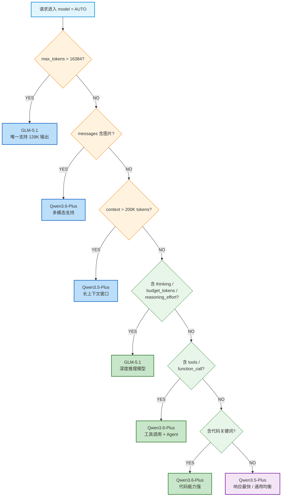

# AUTO 智能模型路由 — 设计文档

> 版本：v1.0 | 日期：2026-04-23 | 作者：awen

---

## 1. 背景与目标

用户在调用 AI API 时，往往不清楚哪个模型最适合当前请求。本功能提供虚拟模型 `AUTO`，系统自动根据请求内容（图片、代码、推理、输出长度等特征）将请求路由到最合适的真实模型。

### 候选模型

| 模型 | 多模态 | 最大输出 | 推理能力 | 适用场景 |
|------|--------|----------|----------|----------|
| Qwen3.6-Plus | 支持（图片） | 16K | 强 | 多模态、代码、Agent |
| Qwen3.5-Plus | 支持（图片） | 16K | 中 | 快速响应、通用对话 |
| GLM-5.1 | 纯文本 | 128K | 强（深度推理） | 长输出、深度推理 |
| GLM-5 | 纯文本 | 16K | 中 | GLM-5.1 的降级备选 |

### 设计原则

- **不考虑价格**，仅按请求特征路由
- **默认快，按需升级**（参考 OpenAI 教训：不要替用户做慢决策）
- **零侵入**：不改变现有模型调用链路，仅在分发环节拦截替换

---

## 2. 行业参考

| 厂商/产品 | 策略 | 关键启示 |
|-----------|------|----------|
| OpenAI | AI 分类器自动选模型（已对免费用户回滚） | 不要替用户做慢决策 |
| GitHub Copilot | 可用性优先，Fast/Edit/Agent 三档 | 简单分档比复杂路由更可靠 |
| Cursor | 复杂度 + 可靠性评分路由 | 明确升级信号比猜测意图更准 |
| OpenRouter/NotDiamond | 第三方路由器，性能+成本+延迟多维度 | 三级路由（硬约束 → 升级信号 → 默认）是业界共识 |

---

## 3. 路由决策树

```
请求进入 (model = "AUTO")
│
├── L0: 硬约束（必须满足）
│   ├── max_tokens > 16384 ?
│   │   └── YES → GLM-5.1（唯一支持 128K 输出）
│   │
│   ├── messages 包含图片（image_url）？
│   │   └── YES → Qwen3.6-Plus（多模态支持）
│   │
│   └── context 长度 > 200K tokens？
│       └── YES → Qwen3.5-Plus（长上下文窗口）
│
├── L1: 升级信号（按优先级）
│   ├── thinking / budget_tokens / reasoning_effort 存在？
│   │   └── YES → GLM-5.1（深度推理模型）
│   │
│   ├── tools / function_call 存在？
│   │   └── YES → Qwen3.6-Plus（工具调用 + Agent）
│   │
│   └── system_prompt 或 messages 含代码关键词？
│       └── YES → Qwen3.6-Plus（代码能力强）
│
└── L2: 默认
    └── Qwen3.5-Plus（响应最快，通用能力均衡）
```

### 路由流程图



> 图例：橙色菱形 = L0 硬约束，绿色菱形 = L1 升级信号，蓝色方框 = L0 路由结果，绿色方框 = L1 路由结果，紫色方框 = L2 默认路由

### 整体处理流程

```mermaid
flowchart LR
    subgraph 客户端
        REQ[发送请求<br/>model = AUTO]
    end

    subgraph 网关处理
        MW[middleware/distributor<br/>拦截 AUTO 请求] --> PARSE[解析请求体<br/>提取路由特征]
        PARSE --> ROUTER[service/auto_router<br/>路由决策引擎]
        ROUTE_RESULT[routed_model] --> REPLACE[替换 model 名称]
    end

    subgraph 正常分发
        REPLACE --> DIST[渠道选择<br/>负载均衡]
        DIST --> RELAY[relay 转发<br/>调用上游 API]
    end

    subgraph 后处理
        RELAY --> LOG[记录日志<br/>model_name=AUTO<br/>routed_model_name=实际模型]
        LOG --> BILL[计费结算<br/>按真实模型倍率]
        BILL --> RESP[返回响应]
    end

    REQ --> MW
    ROUTER --> ROUTE_RESULT

    style REQ fill:#e1f5fe,stroke:#0288d1
    style MW fill:#fff3e0,stroke:#f57c00,stroke-width:2px
    style ROUTER fill:#fff3e0,stroke:#f57c00,stroke-width:2px
    style LOG fill:#e8f5e9,stroke:#388e3c,stroke-width:2px
    style BILL fill:#e8f5e9,stroke:#388e3c,stroke-width:2px
```



### L0 硬约束说明

| 条件 | 检测方式 | 路由目标 | 原因 |
|------|----------|----------|------|
| `max_tokens > 16384` | 解析请求体 `max_tokens` 字段 | GLM-5.1 | 其他模型输出上限为 16K，GLM-5.1 支持 128K |
| 包含图片 | 解析 messages 中 `content` 数组，检测 `type: "image_url"` | Qwen3.6-Plus | GLM 系列不支持多模态 |
| 超长上下文 | 估算 prompt tokens > 200K | Qwen3.5-Plus | 需要超大上下文窗口 |

### L1 升级信号说明

| 信号 | 检测方式 | 路由目标 | 原因 |
|------|----------|----------|------|
| 深度推理 | 请求体含 `thinking`、`budget_tokens`、`reasoning_effort` | GLM-5.1 | 专为深度推理优化 |
| 工具调用 | 请求体含 `tools` 或 `functions` | Qwen3.6-Plus | 工具调用 + Agent 场景表现最优 |
| 代码相关 | system_prompt/messages 含 code/编程/debug 等关键词 | Qwen3.6-Plus | 代码生成能力强 |

### L2 默认路由

- **Qwen3.5-Plus**：响应速度最快，通用能力均衡，适合绝大多数日常对话场景

---

## 4. 实现方案

### 4.1 总体方案：虚拟模型（Plan A）

将 `AUTO` 注册为虚拟模型，在模型元数据表 `model_meta` 中创建一条记录，标识为自动路由模型。用户在模型广场可以看到并选择 AUTO 模型。

```
用户请求 model="AUTO"
    ↓
middleware/distributor.go 拦截
    ↓
检测到 AUTO → 调用路由决策引擎
    ↓
替换 model 为真实模型名称（如 "qwen3.6-plus"）
    ↓
走正常分发流程（选渠道、转发请求）
```

### 4.2 模块设计

#### 4.2.1 AUTO 模型注册

在 `model_meta` 表中新增 AUTO 记录：

```sql
INSERT INTO model_meta (name, label, description, auto_route)
VALUES ('AUTO', 'AUTO', '智能路由 - 自动选择最合适的模型', 1);
```

- `auto_route` 字段标识该模型为自动路由模型
- 模型广场展示时，AUTO 作为普通模型显示，附加"智能路由"标签

#### 4.2.2 路由决策引擎

新增文件 `service/auto_router.go`，核心逻辑：

```go
package service

// RouteRequest 根据请求特征返回最合适的模型名称
func RouteRequest(req *AutoRouteRequest) string {
    // L0: 硬约束
    if req.MaxTokens > 16384 {
        return "glm-5.1"
    }
    if req.HasImage {
        return "qwen3.6-plus"
    }
    if req.EstimatedContextTokens > 200000 {
        return "qwen3.5-plus"
    }

    // L1: 升级信号
    if req.HasThinking || req.HasBudgetTokens || req.HasReasoningEffort {
        return "glm-5.1"
    }
    if req.HasTools || req.HasFunctionCall {
        return "qwen3.6-plus"
    }
    if req.HasCodeSignals {
        return "qwen3.6-plus"
    }

    // L2: 默认
    return "qwen3.5-plus"
}
```

请求特征提取结构：

```go
type AutoRouteRequest struct {
    MaxTokens              int
    HasImage               bool
    EstimatedContextTokens int
    HasThinking            bool
    HasBudgetTokens        bool
    HasReasoningEffort     bool
    HasTools               bool
    HasFunctionCall        bool
    HasCodeSignals         bool
}
```

#### 4.2.3 图片检测

解析 OpenAI 格式的 messages 数组，检测多模态内容：

```go
func detectImage(messages []Message) bool {
    for _, msg := range messages {
        // content 可能是 string 或 []interface{}
        if contentArray, ok := msg.Content.([]interface{}); ok {
            for _, item := range contentArray {
                if part, ok := item.(map[string]interface{}); ok {
                    if part["type"] == "image_url" {
                        return true
                    }
                }
            }
        }
    }
    return false
}
```

#### 4.2.4 代码信号检测

通过关键词匹配检测代码相关请求：

```go
var codeKeywords = []string{"code", "编程", "debug", "函数", "implement", "refactor", "代码"}

func detectCodeSignals(messages []Message, systemPrompt string) bool {
    text := strings.ToLower(systemPrompt)
    for _, msg := range messages {
        if s, ok := msg.Content.(string); ok {
            text += " " + strings.ToLower(s)
        }
    }
    for _, kw := range codeKeywords {
        if strings.Contains(text, kw) {
            return true
        }
    }
    return false
}
```

### 4.3 拦截点

在 `middleware/distributor.go` 中，模型分发前插入 AUTO 路由逻辑：

```go
// 在 SetupContextForSelectedChannel 调用之前
if isAutoModel(modelName) {
    routeReq := extractRouteFeatures(c.Request.Body)
    routedModel := RouteRequest(routeReq)
    c.Set("auto_routed_model", routedModel)  // 记录实际路由的模型
    modelName = routedModel                    // 替换模型名称
}
```

关键：替换在渠道选择之前完成，后续的渠道匹配、计费、日志都使用替换后的真实模型名。

### 4.4 日志增强

#### 方案：扩展 Log 表

在 `model/log.go` 的 Log 结构体中增加 `RoutedModelName` 字段：

```go
type Log struct {
    // ... 现有字段 ...
    ModelName        string `json:"model_name" gorm:"..."`
    RoutedModelName  string `json:"routed_model_name" gorm:"index;default:''"`  // 新增
}
```

记录逻辑：
- `ModelName`：用户请求的模型名（如 "AUTO"）
- `RoutedModelName`：实际路由到的模型名（如 "qwen3.6-plus"）
- 非 AUTO 请求时 `RoutedModelName` 为空，不影响现有日志

### 4.5 前端展示

#### 模型广场

- AUTO 作为独立模型卡片展示
- 卡片上显示"智能路由"标签
- 描述文案："根据请求内容自动选择最合适的模型"

#### 日志页面

- 日志列表增加"路由模型"列
- 当请求模型为 AUTO 时，显示实际使用的模型名称
- 非 AUTO 请求不显示该列内容

---

## 5. 数据库变更

```sql
-- 1. model_meta 表新增 auto_route 字段（如果不存在）
ALTER TABLE model_meta ADD COLUMN auto_route TINYINT DEFAULT 0;

-- 2. 插入 AUTO 虚拟模型记录
INSERT INTO model_meta (name, label, description, auto_route)
VALUES ('AUTO', 'AUTO', '智能路由 - 自动选择最合适的模型', 1);

-- 3. logs 表新增 routed_model_name 字段
ALTER TABLE logs ADD COLUMN routed_model_name VARCHAR(64) DEFAULT '' ;

-- 4. 为 routed_model_name 添加索引（可选）
CREATE INDEX idx_logs_routed_model_name ON logs (routed_model_name);
```

---

## 6. 文件变更清单

| 文件 | 变更类型 | 说明 |
|------|----------|------|
| `service/auto_router.go` | 新增 | 路由决策引擎核心逻辑 |
| `middleware/distributor.go` | 修改 | 插入 AUTO 检测和模型替换逻辑 |
| `model/log.go` | 修改 | Log 结构体增加 `RoutedModelName` 字段 |
| `model/main.go` | 修改 | 数据库迁移，新增字段 |
| `service/quota.go` | 修改 | 计费日志记录时写入路由模型名 |
| `web/src/components/table/models/index.jsx` | 修改 | 模型广场展示 AUTO 标签 |
| 前端日志组件 | 修改 | 日志页面展示路由模型名 |

---

## 7. 配置与扩展

### 7.1 候选模型配置

路由目标模型通过配置文件或数据库管理，支持动态调整：

```json
{
  "auto_route": {
    "models": {
      "multimodal": "qwen3.6-plus",
      "reasoning": "glm-5.1",
      "code": "qwen3.6-plus",
      "long_output": "glm-5.1",
      "long_context": "qwen3.5-plus",
      "default": "qwen3.5-plus"
    },
    "thresholds": {
      "max_tokens_output": 16384,
      "context_tokens": 200000
    }
  }
}
```

### 7.2 扩展性

- 新增候选模型：修改配置中的映射即可
- 新增路由规则：在 `RouteRequest` 函数中增加 L0/L1 条件
- 支持多 AUTO 变体：如 `AUTO-CODE`（只走代码模型）、`AUTO-FAST`（只走快速模型）

---

## 8. 测试计划

### 8.1 单元测试

| 用例 | 输入 | 预期路由 |
|------|------|----------|
| 超长输出需求 | max_tokens=32768 | GLM-5.1 |
| 图片理解 | messages 含 image_url | Qwen3.6-Plus |
| 深度推理 | 含 thinking 字段 | GLM-5.1 |
| 工具调用 | 含 tools 字段 | Qwen3.6-Plus |
| 代码生成 | system_prompt 含"写一段代码" | Qwen3.6-Plus |
| 普通对话 | 无特殊信号 | Qwen3.5-Plus |
| 图片+长输出 | image_url + max_tokens=20000 | GLM-5.1（L0 优先级：max_tokens） |

### 8.2 集成测试

- AUTO 模型在模型广场正确展示
- 请求 AUTO 后日志中同时记录 AUTO 和真实模型名
- 计费按真实模型倍率计算
- 非 AUTO 请求不受影响

---

## 9. 风险与应对

| 风险 | 影响 | 应对 |
|------|------|------|
| 路由决策增加延迟 | 毫秒级（本地计算），可忽略 | 特征提取使用简单规则，不调用外部服务 |
| 代码关键词误判 | 简单对话被路由到代码模型 | L1 信号权重低于 L0，默认回退 Qwen3.5-Plus |
| 模型不可用 | 路由到的模型无可用渠道 | 降级到默认模型 Qwen3.5-Plus，记录告警 |
| 日志字段膨胀 | 存储空间增加 | RoutedModelName 仅对 AUTO 请求有值，影响极小 |
